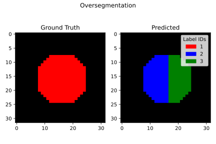
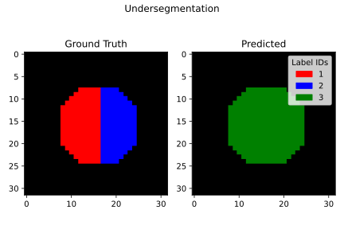

Description of Unit Test Canonical Examples
===========================================

To facilitate testing, we have provided a suite of canonical examples
that cover the basic, simple scenarios that can occur in segmentation and
tracking. Here we describe them and show visualizations of each case.

Matchers should test all the segmentation cases. Metrics should test all the
tracking cases. The examples are generated by functions in the `tests/examples/`
directory.

Segmentation Canonical Examples
-------------------------------

.. image:: segmentation/2d/Good\ Segmentation.svg
.. image:: segmentation/2d/False\ Negative.svg
.. image:: segmentation/2d/False\ Positive.svg

Matched Graph Canonical Examples
--------------------------------

.. image:: matched_graph/Good\ Matching.svg
.. image:: matched_graph/False\ Negative\ Node.svg
.. image:: matched_graph/False\ Negative\ Edge.svg
.. image:: matched_graph/False\ Positive\ Node.svg
.. image:: matched_graph/False\ Positive\ Edge.svg
.. image:: matched_graph/Two\ Ground\ Truth\ to\ One\ Prediction.svg
.. image:: matched_graph/One\ Ground\ Truth\ to\ Two\ Predictions.svg
.. image:: matched_graph/Empty\ Ground\ Truth.svg
.. image:: matched_graph/Empty\ Prediction.svg